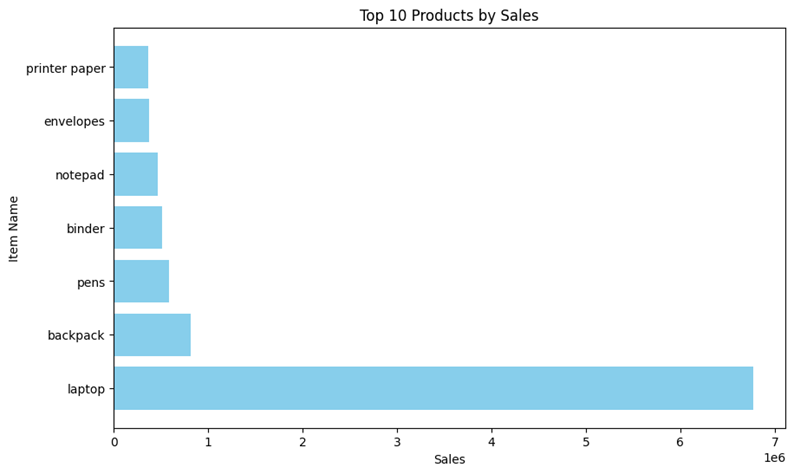
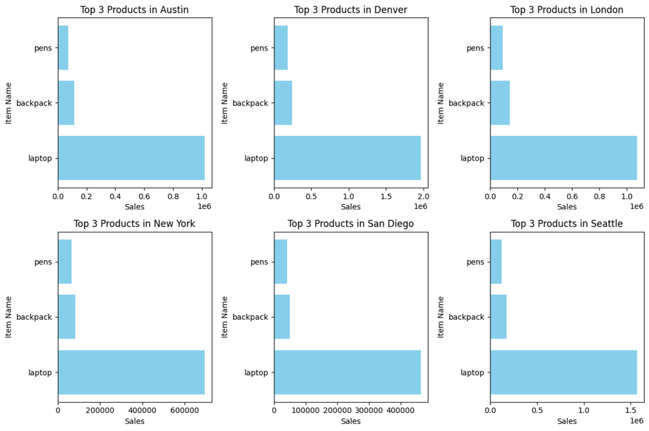
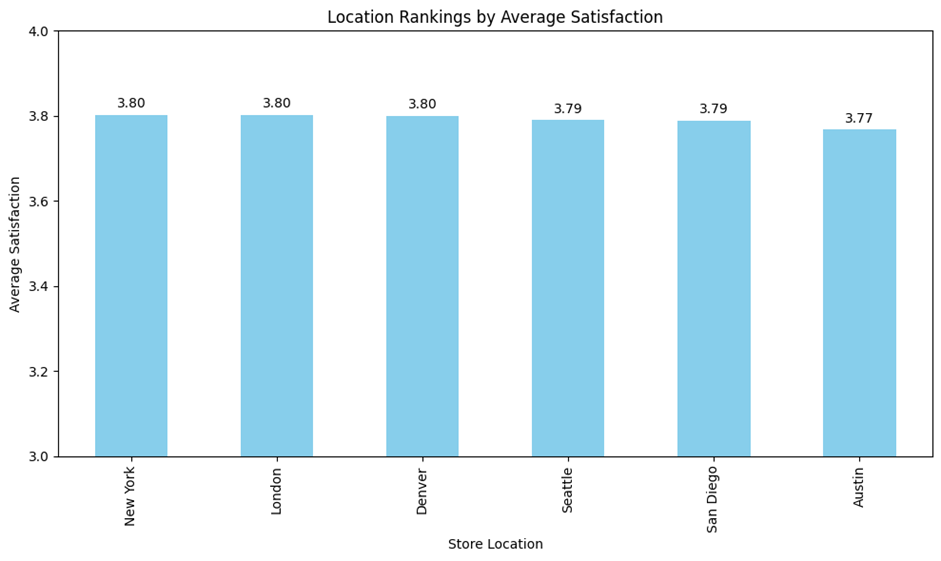
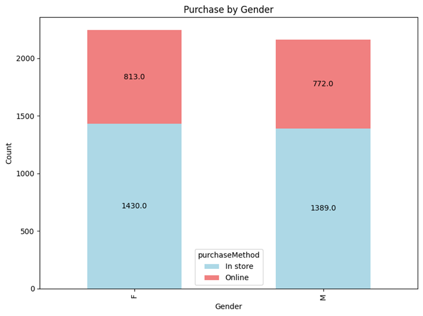
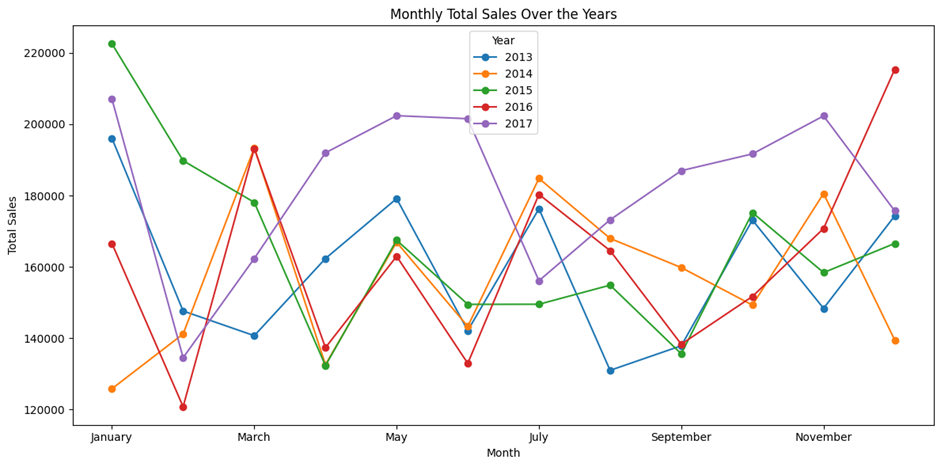

# Project 3 Report
Semi-Structured Data Analytics

## Table of Contents

- [1. Introduction](#1-introduction)
- [2. Data Pipeline](#2-data-pipeline)
- [3. Query Analysis](#3-query-analysis)
  - [Query 1: Top 10 Products by Sales](#query-1-top-10-products-by-sales)
  - [Query 2: Top 3 Products by Sales for Each Store](#query-2-top-3-products-by-sales-for-each-store)
  - [Query 3: Store Rankings](#query-3-store-rankings)
  - [Query 4: Purchased Method by Gender](#query-4-purchased-method-by-gender)
  - [Query 5: Monthly Total Sales](#query-5-monthly-total-sales)
- [4. Presentation Video](#4-presentation-video)
- [5. Notebook as an Article](#5-notebook-as-an-article)

## 1. Introduction

In this report, we dive into the world of data analysis using a dataset called "sample_supplies" from MongoDB. Our aim is to discover interesting insights and provide answers to important questions.

We follow a step-by-step process to analyze the data and use a Jupyter Notebook for our analysis. The results are shared in a notebook on GitHub, where we explain our findings.

## 2. Data Pipeline

We obtain the data from MongoDB sample data. We have the option to choose between two formats: CSV or JSON. We opt for the JSON format since the original data is also in JSON format. We use pandas to read the JSON format. The data is exported using the mongo export command.

## 3. Query Analysis

### Query 1: Top 10 Products by Sales

This query identifies the top 10 products by sales. Since there is no "sales" column, we calculate it by multiplying quantity and price. The visualization in the graph shows that "Laptop" has the highest sales compared to other items.

### Query 2: Top 3 Products by Sales for Each Store

This query displays the top 3 products by sales for each store. The graph represents each location and their respective sales. It's evident that all locations perform well with "Laptop," followed by "Backpack," and "Pens" as the top 3 products.

### Query 3: Store Rankings

This query focuses on store rankings. The ranking criteria can be based on sales or customer satisfaction. We chose to rank stores by customer satisfaction. The analysis shows that "New York," "London," and "Denver" are tied for first place with an average rating of 3.8/5. The lowest rating is from "Austin" with a rating of 3.77/5.

### Query 4: Purchased Method by Gender

This query reveals the demographic of people who purchase items online or in-store. The analysis suggests that both genders prefer buying items in-store rather than online.

### Query 5: Monthly Total Sales

The graph illustrates the monthly sales performance over a 5-year period (2013–2017). It shows that sales generally peak during April or July, indicating potential opportunities for better deals during those months.

## 4. Presentation Video

[Link to Presentation Video on YouTube](https://youtu.be/uBy5NwGCqZg:target="_blank")

## 5. Notebook as an Article

[Link to the Jupyter Notebook on GitHub](https://github.com/sawzwe/bigdata_project3/blob/main/project_3.ipynb:target="_blank")

## Keywords

Data Analytics, MongoDB, Jupyter Notebook, GitHub, Ingestion, Transformation, Insights, Data Pipeline, Query Analysis.
